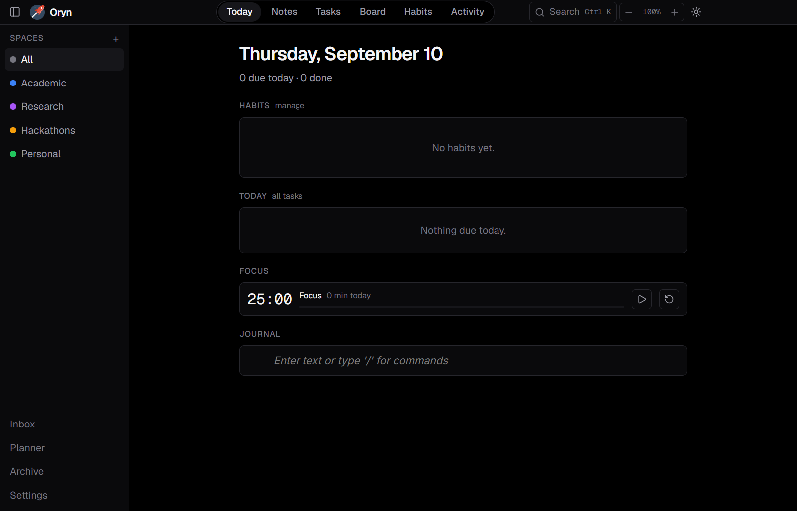
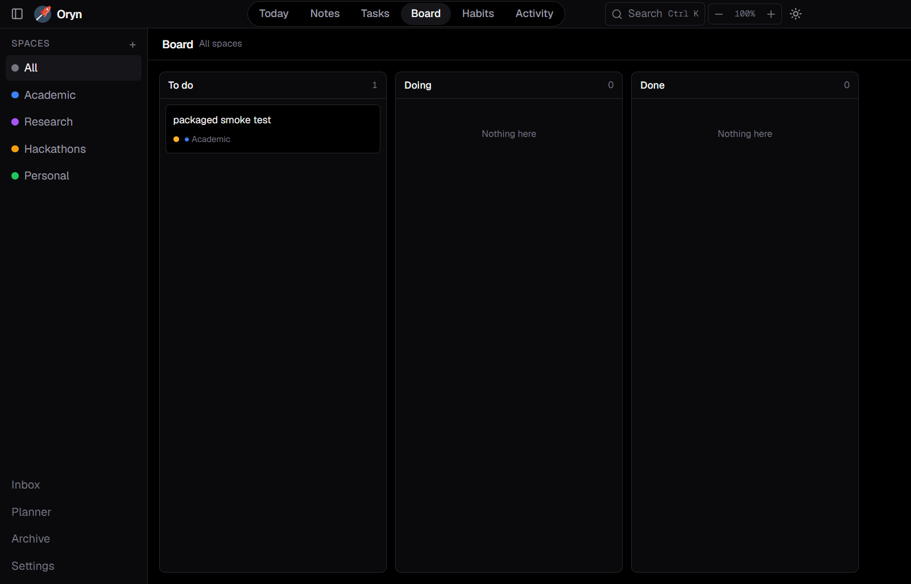
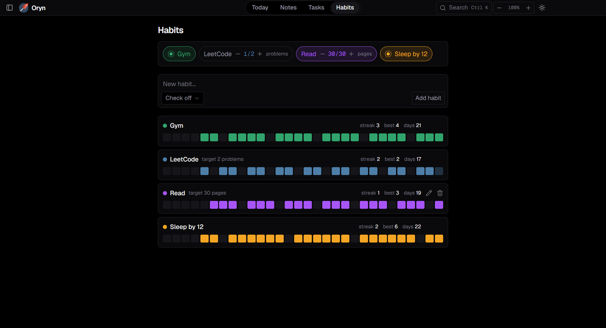

# Oryn


A lightweight personal productivity OS for Windows — notes, tasks, habits,
journal, and planning in one local-first desktop app. No account, no cloud,
no subscription: everything lives in one SQLite file on your machine.

## Screenshots

<!--
  Drop image files into docs/screenshots/ using the names below (or send
  them in chat and they'll be saved here), then this section renders them.
  Suggested shots: the Today dashboard, Notes with an open note, the Tasks
  board, Habits, and the Review screen.
-->

| | |
|---|---|
|  |  |
|  |  |

## Features (v0.1.0)

### Notes
- Block-based rich text editor (headings, lists, checkboxes, code, images)
- Organize notes into Spaces, pin favorites, archive instead of delete
- Paste or drop an image straight into a note
- `#tags` and `[[Note Title]]` backlinks, parsed automatically as you type
- A "Linked mentions" panel shows every note that references the one you're on
- Pop a note out into its own always-on-top-capable window

### Tasks & Board
- Due dates, priority, subtasks, and recurring tasks (daily/weekdays/weekly/monthly)
- A kanban Board view (To do / Doing / Done) alongside the list view
- Attach files to a task, opened with whatever your OS associates with them
- Missed tasks automatically roll forward to today on launch
- A due-date suggestion hint, based on how long similar tasks took before

### Habits
- Simple check-off or countable habits, scoped to a Space
- Current streak, longest streak, and a 30-day history strip per habit
- Habit correlations: which habits tend to get done on the same days

### Journal & Planner
- One journal entry per day, same block editor as Notes
- Deadlines (exams, submissions, hackathons) with a "days remaining" countdown
- A weekly class timetable
- A Pomodoro focus timer that logs completed sessions — pop it out as a small
  always-on-top floating timer that stays in sync with the dashboard
- Quick Capture: a global hotkey opens a tiny always-on-top box to jot a
  thought without leaving whatever you're doing; capture later files it into
  a note or task from the Inbox

### Search & review
- Cmd/Ctrl+K command palette searches notes, tasks, habits, and journal at once
- An activity heatmap across everything you do
- A Review screen: tasks done vs. created, habit completion %, journal
  entries, and busiest Space — for this week or month, compared to the one
  before it

### Checklist templates
- Save a named checklist once, spawn it into today as a batch of tasks
  whenever you need it (e.g. a recurring "Morning routine")

### Privacy & safety
- Everything stays on your machine — no network access, no telemetry
- Optional 4-digit PIN lock, with auto re-lock after an idle timeout
- One-click database backup and a Markdown export of all your notes
- Daily reminder notification for tasks due today or a habit streak at risk

### Distraction-free mode
- Hide the sidebar and top bar to just write; Escape brings them back

## Getting started

```bash
git clone https://github.com/sarvan-2187/Oryn.git
cd Oryn
npm install
npm run dev
```

### Building an installer

```bash
npm run dist
```

Produces a Windows installer at `dist/Oryn Setup <version>.exe`.

### Running the tests

```bash
npm test
```

## Tech stack

Electron, React, TypeScript, Tailwind CSS, [BlockNote](https://www.blocknote.dev/)
for the rich text editor, [zustand](https://github.com/pmndrs/zustand) for
state, and [better-sqlite3](https://github.com/WiseLibs/better-sqlite3) for
storage — one `.db` file, no server, no ORM.

## License

MIT
